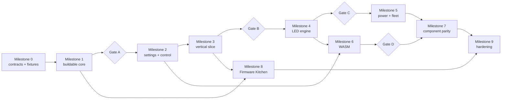

# V2 PR and issue dependency map

Each work package is an issue and normally one focused PR. A PR declares
`Work-package`, `Depends-on`, `Profiles-tested`, compatibility impact, rollback,
migration, and evidence links. An epic is coordination only and must not be used
to hide unrelated implementation in one PR.

## Milestones 0–3

| ID | Issue/PR title | Depends on | Contract produced |
| --- | --- | --- | --- |
| `0.1` | Inventory V1 public behavior | pinned V1 commit | compatibility matrix and component inventory |
| `0.2` | Capture deterministic V1 fixtures | `0.1` | fixture manifest, generators, raw/golden data, offline validator |
| `0.3` | Accept foundational ADRs and gates | `0.1` | lifecycle, resource, threading, memory, persistence, compatibility decisions; target profiles and gates |
| `1.1` | Bootstrap ESP-IDF/C++20 multi-target project | all `0.x` | dependency lock, formatting/lint config, CI matrix, minimal firmware |
| `1.2` | Component descriptor, registry, lifecycle | `1.1`, ADR-0001 | validated registry and lifecycle state machine |
| `1.3` | Typed parameters, actions, events, metadata | `1.2` | versioned machine-readable descriptor schema |
| `1.4` | Resource broker and manifest conflict checks | `1.2`, ADR-0002 | leases/capabilities for pins, buses, DMA, memory, radio |
| `1.5` | Scheduler and bounded event bus | `1.2`, ADR-0003, ADR-0004 | task classes, bounded queues, overflow metrics |
| `GA` | Prove common core on ESP32/S3/C6 | `1.1`–`1.5` | Gate A evidence on one reference board per target |
| `2.1` | Versioned atomic NVS settings | `GA`, ADR-0005 | per-component records and two-generation commit |
| `2.2` | LittleFS and optional SD storage services | `1.4`, `2.1` | atomic file replacement and storage capability |
| `2.3` | Settings migration and V1 import | `2.1`, `0.2`, ADR-0006 | idempotent V1 importer with retained source blob |
| `2.4` | Diagnostics, metrics, crash records, safe mode | `1.5`, `2.1` | structured diagnostics and boot-loop recovery |
| `2.5` | Versioned transport envelope and Serial/USB | `1.3`, `1.5`, `0.2` | transport-neutral message contract and legacy serial adapter |
| `2.6` | Wi-Fi management and provisioning | `1.4`, `2.1`, `2.5` | station/AP provisioning state machine |
| `2.7` | OSC UDP and OSCQuery HTTP/WebSocket | `1.3`, `2.5`, `2.6`, `0.2` | registry-derived discovery and legacy OSC adapter |
| `3.1` | Schema-driven web shell | `1.3`, `2.7` | generic controls generated from descriptor schema |
| `3.2` | Filesystem manager and web asset bundles | `2.2`, `3.1` | independently versioned/verified UI assets |
| `3.3` | A/B OTA and rollback | `2.4`, `2.6` | signed/profile-checked update and boot confirmation |
| `3.4` | LED transport qualification ADR and native RMT functional vertical slice | `1.4`, `1.5`, `2.7` | measured per-target transport guidance, first output driver and registry-exposed strip; RMT baseline is non-binding for production |
| `3.5` | Browser installer manifests | `3.2`, `3.3` | factory/install bundle and browser flow |
| `3.6` | Pin reservation inspector and conflict-safe editor | `1.3`, `1.4`, `2.1`, `3.1` | complete pin/claim schema, atomic reassignment, and shared-bus-aware controls |
| `3.7` | Simple/Advanced device web interface and presentation metadata | `3.1`, `3.6`, `6.6` for dynamic refresh | polished main controls and graphical sensors; exhaustive topic/component configuration |
| `3.8` | Release catalog and firmware/web update center | `3.2`, `3.3`, `3.5`, `3.7` | authenticated device-specific catalog, independent versions, compatibility checks and progress |
| `3.9` | Device-side HTTPS self-update service | `3.8`, `2.1`, `2.6` | bounded checks/downloads without an open browser, policy, atomic assets and firmware rollback |
| `GB` | Prove install-to-rollback vertical slice | `3.1`–`3.9` | Gate B evidence, including Simple/Advanced UI, self-updates, exclusive-pin conflict prevention and legal I2C sharing |

## Milestones 4–6

| ID | Issue/PR title | Depends on | Contract produced |
| --- | --- | --- | --- |
| `4.1` | Pixel surface, protocol boundary and output-driver ABI | `GB`, `3.4` | format/lane/timing/buffering/DMA/sync/resource capability ABI |
| `4.2` | Deterministic layered compositor | `4.1`, `1.5` | stream/playback/script/system layer semantics |
| `4.3` | Linear-light color pipeline | `4.1` | transforms, ordering, calibration, golden vectors |
| `4.4` | Async submission, preallocated DMA/staging pools, deadline metrics | `4.1`, `4.2`, ADR-0004 | allocation-free, bounded and observable render/output pipeline |
| `4.5` | Native SPI-DMA clocked-strip drivers | `4.1`, `4.3`, `4.4` | analyzer-qualified APA102/SK9822/HD108-family backends |
| `4.6a` | Qualified RMT and SPI-encoded one-wire transports plus deterministic selector | `4.1`, `4.4`, `3.4` | measured target/length crossover policy, forced selection and diagnostic reason |
| `4.6b` | Target-neutral parallel-wave backend with ESP32 I2S/LCD, S3 LCD_CAM and C6 PARLIO adapters | `4.1`, `4.4`, `3.4` | removable parallel transport with qualified lane/timing/resource limits |
| `4.6c` | Optional FastLED compatibility backend | `4.1`, `4.3` | removable compatibility driver using the common output ABI |
| `4.7` | Streaming, playback, and legacy import | `4.2`, `4.4`, `2.2`, `0.2` | bounded streaming and versioned playback format/importer |
| `4.8a` | Art-Net/DMX compatibility | `4.7`, `2.6` | optional Art-Net/DMX component |
| `4.8b` | Optional E1.31 component | `4.7`, `2.6` | independently removable E1.31 input |
| `4.8c` | Optional DDP component | `4.7`, `2.6` | independently removable DDP input |
| `GC` | LED/network sustained-load gate | `4.1`–`4.8a` | Gate C evidence |
| `5.1` | Battery sensing and calibration | `GC`, `1.4`, `2.1` | board-calibrated battery service |
| `5.2` | LED power estimation and limiting | `4.3`, `5.1` | smoothed and hard power budgets |
| `5.3` | Power management, sleep, wake | `5.1`, `1.5` | coordinated locks and measured sleep profiles |
| `5.4` | RadioManager policies | `1.4`, `2.6`, `5.3` | explicit live-suspend/reboot-reclaim radio profiles |
| `5.5` | NimBLE transport; optional ESP32 Classic BT | `5.4`, `2.5` | removable BLE service/serial transport |
| `5.6` | Versioned V2 ESP-NOW | `5.4`, `2.5` | bounded V2 protocol, ACK/fragment/dedup, peer HIL |
| `5.7` | Fleet clock, leader election, scheduled cues | `5.6`, `1.5` | non-blocking autonomous coordination |
| `6.1` | wasm3/WAMR target benchmark | `GC`, `1.1` | reproducible benchmark and runtime ADR |
| `6.2` | Runtime-neutral WASM service | `6.1`, `1.3` | replaceable runtime interface |
| `6.3` | WASM budgets, cancellation, isolation | `6.2`, `1.5`, ADR-0004 | bounded execution and fault records |
| `6.4` | Checked UTF-8 pointer/length ABI | `6.3` | string ABI and negative tests |
| `6.5` | Component-owned capability providers | `6.2`, `1.3` | decentralized capability registration |
| `6.6` | Script-defined parameters/actions/events | `6.4`, `6.5`, `3.1` | automatic registry/OSCQuery/web exposure |
| `6.7` | Generated SDK bindings and LED script layer | `6.6`, `4.2` | versioned SDK and examples |
| `GD` | Faulty-script continuity gate | `6.1`–`6.7` | Gate D evidence |

## Milestone 7 parity epic

Each row is its own PR and uses the standard parity checklist: resource
declaration, schema, migration, OSCQuery/web exposure, host tests, hardware
record, and per-profile flash/RAM delta.

| ID | Component | Depends on |
| --- | --- | --- |
| `7.1` | Generic GPIO and PWM | `GC`, `1.4`, `2.3` |
| `7.2` | Button and DIP switch | `7.1` |
| `7.3` | Battery/power parity | `5.1`–`5.3` |
| `7.4` | IR input | `7.1` |
| `7.5` | Distance sensors | `1.4`, `2.3` |
| `7.6` | BNO055 | `1.4`, `2.3` |
| `7.7` | BNO08x and M5 variants | `7.6` |
| `7.8` | PWM LED | `7.1`, `5.2` |
| `7.9` | Servo | `7.1` |
| `7.10` | Stepper | `7.1` |
| `7.11` | DC motor | `7.1`; parity scope requires user evidence because V1 is incomplete |
| `7.12` | Display | `1.4`, `3.1` |
| `7.13` | Wired DMX | `4.8a`, `1.4` |
| `7.14` | RF24 | `1.4`; scope requires user evidence because V1 component is empty |
| `7.15` | Behaviour | `1.3`, `1.5`, `2.3` |
| `7.16` | Sequence | `1.3`, `1.5`; scope requires user evidence because V1 is empty |
| `7.17` | Flowtoys Connect | `7.2`, `7.13`, `7.14` |
| `7.18` | Useful legacy LED FX interfaces | `4.2`, `7.7`; explicit selection required |
| `7.19` | Dummy/test component | `1.3`, `3.1` |

## Milestones 8–9

| ID | Issue/PR title | Depends on |
| --- | --- | --- |
| `8.1` | Board/feature/profile manifest schemas | `GA`, `1.4` |
| `8.2` | Deterministic config/partition/pin/web generation | `8.1`, `1.3` |
| `8.3` | Local CLI and containerized builder | `8.2` |
| `8.4` | Web Firmware Kitchen | `8.2`, `3.1`, `3.5` |
| `8.5` | CI cache and release artifact matrix | `8.3`, `8.4` |
| `9.1` | Boundary fuzzing campaign | relevant parser work packages, `GD` |
| `9.2` | Reset/brownout/network/storage fault injection | `GB`, `5.3` |
| `9.3` | Multi-day LED/network/fleet soak | `GC`, `5.7` |
| `9.4` | Stack/heap qualification | `9.3`, canonical profiles |
| `9.5` | OTA interruption qualification | `3.3`, `8.5` |
| `9.6` | All-target canonical profile qualification | all required `7.x`, `8.5` |
| `9.7` | Bring-up and authoring guides | `9.6` |
| `9.8` | Alpha/beta release progression | `9.1`–`9.7` |
| `CUT` | Default/cutover decision | successful alpha and beta, explicit approval |

## Merge rules

- Dependency means the upstream contract is merged and stable, not merely open.
- A compatibility fixture change and the implementation that motivates it are
  separate review points unless the old fixture was provably wrong.
- Public OSC path changes, removal of a legacy format, materially different
  runtime dependencies, and any V1 move/delete stop at an approval issue.
- Hardware-required acceptance cannot be waived by host simulation. The PR may
  remain draft or explicitly incomplete; its dependent gate stays closed.
- Rollback is normally feature/profile disablement plus the prior artifact. Data
  migrations also state whether downgrade is lossless, lossy, or blocked.
